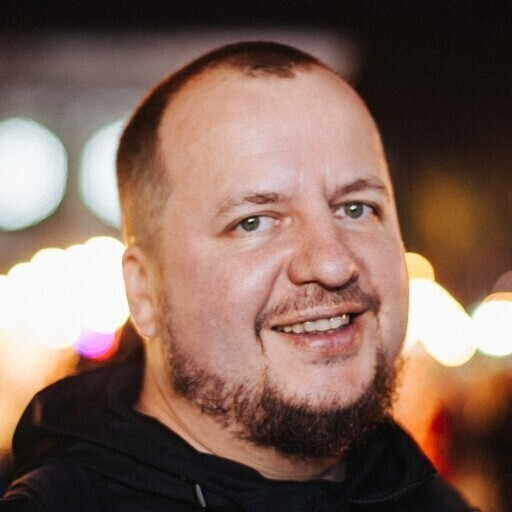

## About

I'm Oleg Neizhkasha, from Kyiv, Ukraine.

I work on Web 8+ years, love functional programming as a function compositions and as type systems, worked with OOP, distributed systems, concurency. 

I always ready to learn something new and don't affraid a legacy. I can deeply dive into bugs for finding solution.

### Contacts:
- email: [oleg.neizhkasha@gmail.com](mailto:oleg.neizhkasha@gmail.com)
- phone, whatsApp, signal, telegram, viber: +380972152313

## Skills

### lang (good) 
 - Clojure
   - [manifold](https://aleph.io/manifold/rationale.html), [aleph.http](https://aleph.io/aleph/http.html), [hugsql](https://www.hugsql.org/)
 
 - ClojureScript
   - [tonsky/rum](https://github.com/tonsky/rum), [day8/re-frame](http://day8.github.io/re-frame/), [reagent-project/reagent](https://github.com/reagent-project/reagent), [funcool/promesa](https://cljdoc.org/d/funcool/promesa)
 
 - JavaScript
   - [React](https://reactjs.org/), [Redux](https://redux.js.org/)

 - Python
   - [Django](https://www.djangoproject.com/), [Flask](https://flask.palletsprojects.com/)

 - Go
   - goji, [gorilla/mux](https://github.com/gorilla/mux)
 
 - Shell

### lang (familiar) 
 - Erlang/OTP
 - Scala
 - Ruby (Rails)
 - Rust

### db
 - SQL:
   - MySQL, PgSQL, SQLite
 - NoSQL:
   - CouchDB, MongoDB
   - Redis, Riak

### tool
 - Jenkins
 - ansible
 - docker
 - k8s
 - nginx

## Experince

### Jul 2021 - Jul 2022: [Hopin](https://hopin.com/)

- Role: Senior Software Engineer
- Responsibilities:
  - project "Audience CRM": worked on infrastructure for Clojure application, based on k8s
  - project  "Onboarding": worked on Event Creation Wizard mostly as backend engineer(Rails), however take React/Redux tasks too.
 
### Jan 2014 - Jul 2021: [Attendify](https://attendify.com/)
 
- Roles: Software Engineer > FrontEnd Team Lead >Senior Software Engineer
- Responsibilities: 
  - Worked on many features
  - Created and supported main web application (React hosted on Django) and features integration
  - Created and supported feature specific services on Clojure, Golang, Python, Scala 
  - Created and supported feature specific client side applications on ClojureScript, JavaScript
  - Worked on insfrastructure and tools 
  
### Jan 2012 - Dec 2013 [form. Cogniance](https://star.global)

- Roles: FrontEnd Engineer (JavaScript)
  
### Nov 2009 - Dec 2012 Lohika 

- FrontEnd Engineer(Perl,JavaScript, C#)
  
### Jun 2009 - Nov 2009 Tzifir (SMM Agency)

- Web developer(JavaScript, PHP, Wordpress, Drupal)

### Sep 2008 - May 2009 Magnet (Web projectes)

- Web developer(Perl, Python/Django, JavaScript)
  
### Jul 2007 - Aug 2008 Redtram (Ads platform)

- Web developer(Perl, PHP)
  
### Dec 2004 - Jun 2007 [Perevorot](https://perevorot.com) (Web Design Studio)

- Web developer(PHP, JavaScript)

## Education

1998 - 2004 M.Sc., Faculty of Applied Mathematics, National Technical University of Ukraine “Igor Sikorsky Kyiv Polytechnic Institute”

## Outside work

My daughter, my wife, my mom. Ukraine. Love snowboarding, bike with my daughter, yachting or snorkeling with friends, traveling. 